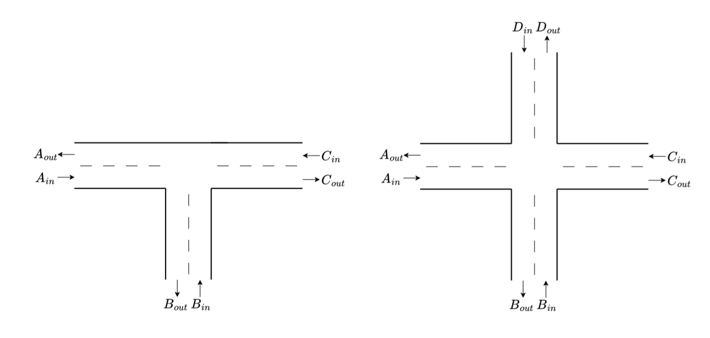
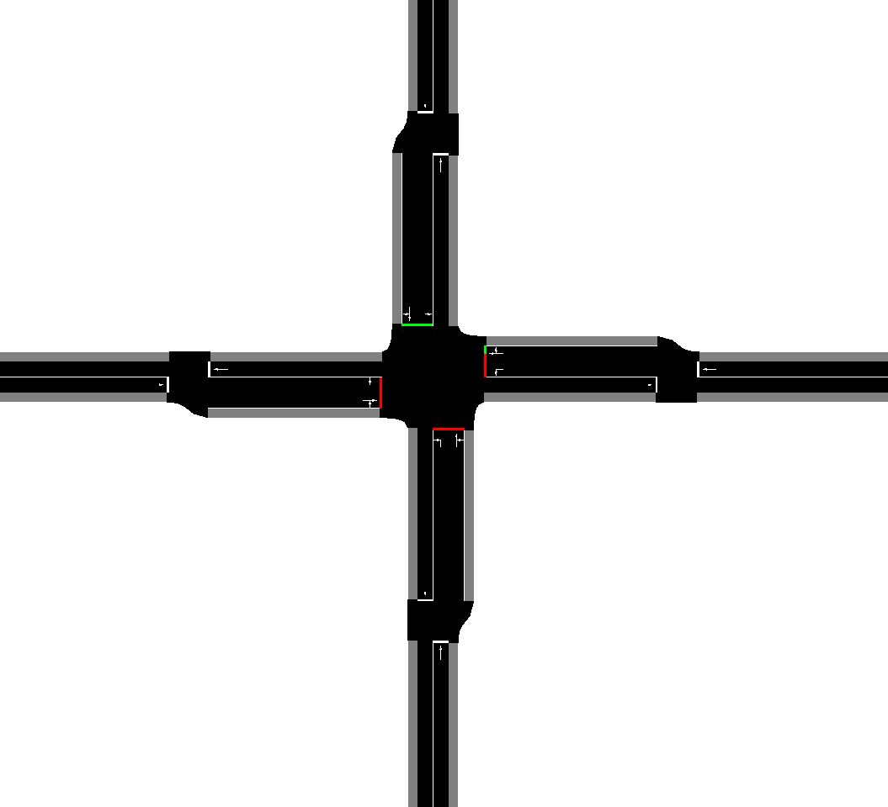
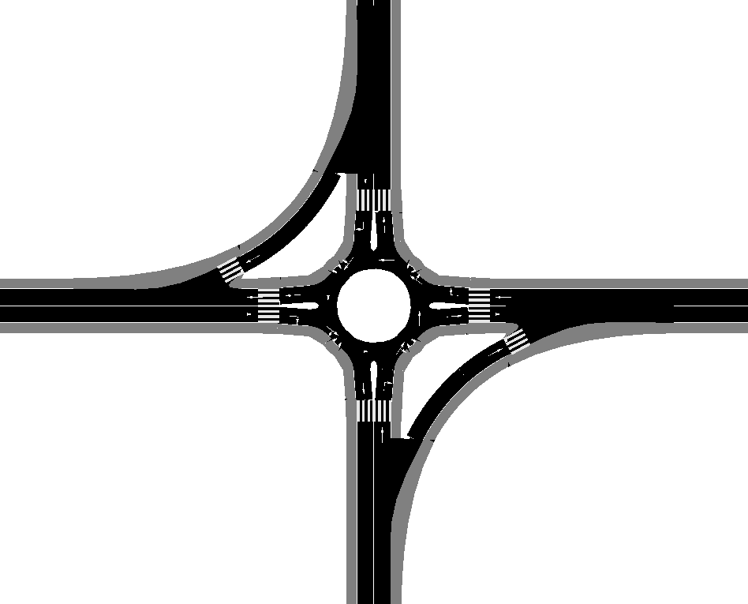
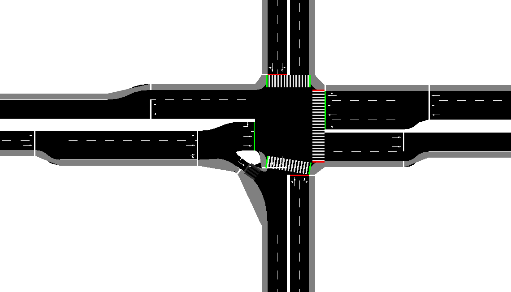
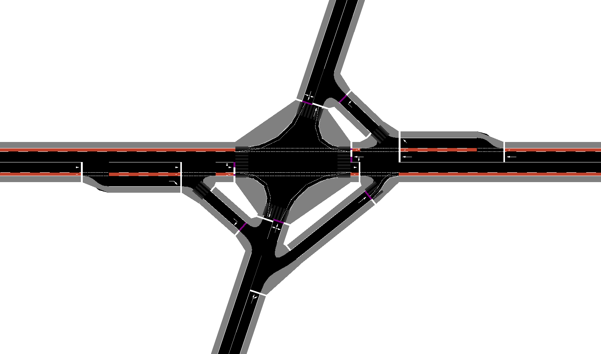
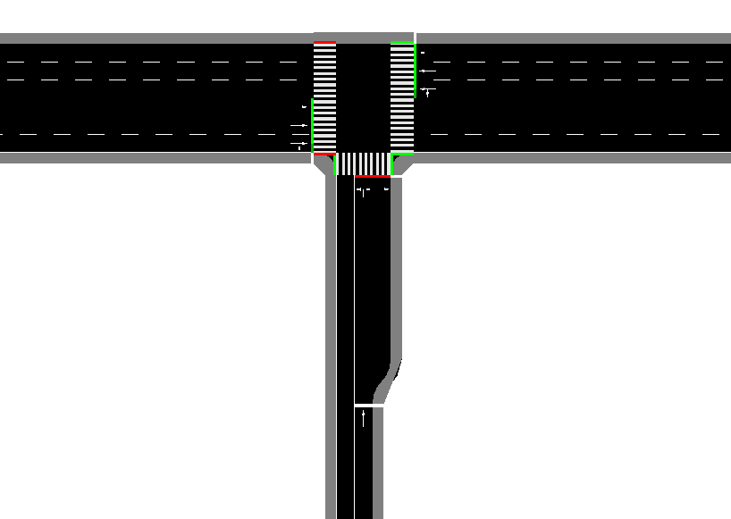
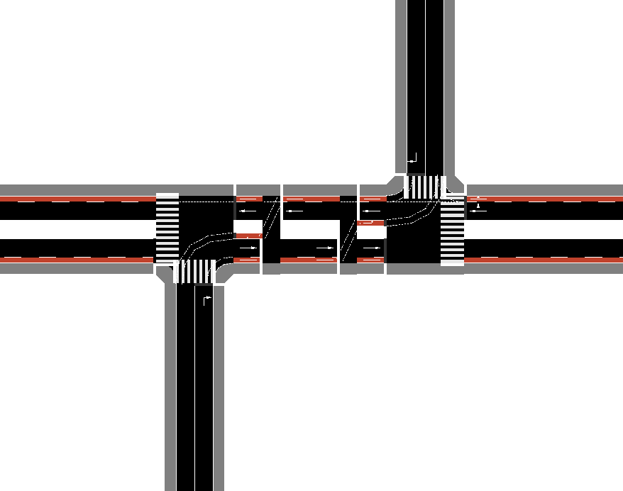

# SUMO Intersection Catalog

A set of network files for SUMO traffic simulator, representing different types of multimodal intersections including different turning rules, traffic lights, bicycle- and pedestrian crossings. The goal of this intersection list is to benchmark the performance of different control algorithms in diverse and realistic intersection scenarios. Some of the intersections are very simple, such as the right-of-way intersection, but some are complex and inspired by real intersections or created based on https://nacto.org/publication/urban-street-design-guide/intersections/

The list is limited to 3-legged and 4-legged intersections. In each case, the center of the intersection is at the (0, 0) coordinate and each leg is 200 meters long. For ease of automation and mass scenario generation, each intersection follows the same edge naming convention, see below. 

# Examples

